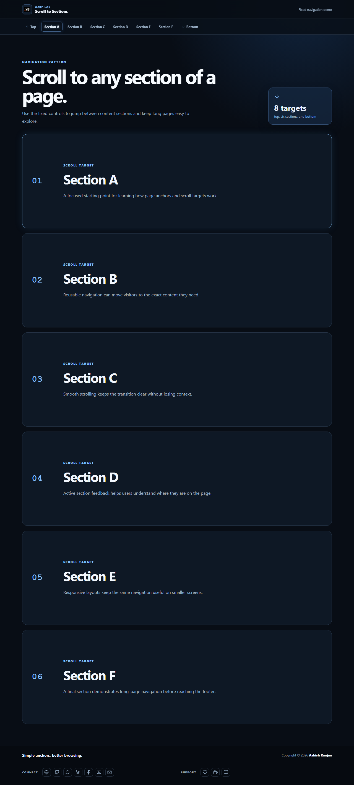

# Scroll to Any Section of a Page

A responsive React demo for jumping between sections of a long page with fixed navigation controls.

## Features

- Smooth scrolling to the top, bottom, and six content sections
- Active section highlighting with Intersection Observer
- Fixed responsive header and horizontal section navigation
- Icon-only footer links and mobile-friendly layout

## Tech stack

React, Create React App, JavaScript, Sass, and react-icons.

## Run locally

```bash
npm install
npm start
```

Create a production build with `npm run build`. Deploy with `npm run deploy`.

## Live

[Open the Scroll to Any Section demo](https://a2rp.github.io/scroll-to-any-section-of-page/)



## Links

- [Portfolio](https://www.ashishranjan.net/)
- [GitHub](https://github.com/a2rp)
- [CodePen](https://codepen.io/ash1198)
- [LinkedIn](https://www.linkedin.com/in/aashishranjan)
- [Facebook](https://www.facebook.com/theash.ashish/)
- [YouTube](https://www.youtube.com/@ashishranjan-ashz?sub_confirmation=1)
- [Email](mailto:ash.ranjan09@gmail.com)

## Support

- [Support](https://a2rp-donation-page.netlify.app/)
- [Buy Me a Coffee](https://buymeacoffee.com/a2rp)
- [Patreon](https://patreon.com/a2rp)
